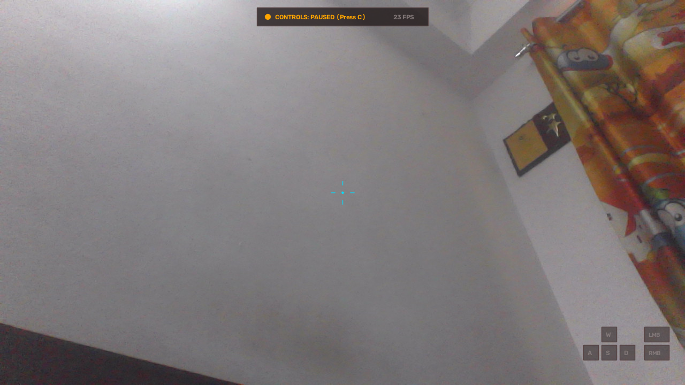

# Gesture-Based Shooting Game Controller

A fully functional native Python Computer Vision desktop application that converts your laptop webcam and hand gestures into **real, stateful OS-level keyboard (`W`, `A`, `S`, `D`) and mouse (`LMB`, `RMB`, Screen Mouse Look)** to control PC shooting games.



---

## Table of Contents
- [Overview](#overview)
- [Key Features](#key-features)
- [Controls & Gesture Guide](#controls--gesture-guide)
  - [How to Shoot, Aim, and Look Around](#how-to-shoot-aim-and-look-around)
  - [Controls Reference Table](#controls-reference-table)
- [Architecture](#architecture)
- [Tech Stack](#tech-stack)
- [Installation](#installation)
  - [Linux (Ubuntu / Debian)](#linux-ubuntu--debian)
  - [Windows](#windows)
  - [macOS](#macos)
- [Usage Workflow](#usage-workflow)
- [Safety & Failsafe Guarantees](#safety--failsafe-guarantees)
- [Calibration Guide](#calibration-guide)
- [Configuration Reference](#configuration-reference)
- [Troubleshooting](#troubleshooting)

---

## Overview

This project provides a hands-free gaming controller designed for desktop PC games. Using **MediaPipe Hands** and **OpenCV**, it detects 21 3D hand landmarks in real time, applies rotation-invariant geometric feature extraction, filters input noise via temporal stabilization (voting windows + Schmitt-trigger hysteresis), and translates recognized gestures into physical OS-level key presses (`W`, `A`, `S`, `D`), mouse button events (`Left Mouse Button` to shoot, `Right Mouse Button` to aim/ADS), and **real-time mouse cursor displacement** to move the screen / rotate the camera.

> [!IMPORTANT]
> **Stateful Input Without Spamming**: Unlike naive scripts that spam `click()` or `press()` every frame, this system maintains an internal state machine for `keyDown`/`keyUp` and `mouseDown`/`mouseUp`. Keys are held smoothly like a real physical keyboard or mouse. Conflicting directions (e.g. `W + S` or `A + D`) are automatically prevented.

---

## Key Features

* **Mouse Screen Movement (Camera Steering / Aim Look)**: Moving your hand smoothly drives the mouse cursor to rotate your in-game view/camera.
* **ADS Precision Aiming**: When entering ADS (Fist pose), mouse sensitivity scales down automatically (0.50x) for precision target acquisition.
* **Minimalist Cyberpunk Gaming HUD**: Floating top status capsule, dynamic reactive crosshair, and glowing key chips with 95%+ unobstructed camera view. Zero bulky opaque boxes.
* **Full-Screen Support (F Key)**: Press `F` to toggle borderless fullscreen with deep-black padding (zero white pillarboxing/letterboxing).
* **HUD Toggle (H Key)**: Press `H` to toggle the HUD overlay on or off completely for an uninterrupted camera view.
* **HD 720p @ 30 FPS Capture**: Native V4L2 + MJPG hardware stream negotiation for smooth, high-fidelity tracking.
* **EMA Landmark Smoothing**: Exponential Moving Average filter eliminates high-frequency hand tremors and skeletal jitter.
* **Schmitt-Trigger Hysteresis**: Dual-threshold pinch trigger prevents boundary jitter and rapid click spamming.
* **Safety Enable / Disable Mode**: Starts with controls paused (`CONTROLS: PAUSED`), allowing you to test gestures and camera positioning before activating game controls.
* **Instant Emergency Stop**: Pressing `Q` or `ESC` immediately releases all held keys/mouse buttons and safely terminates the process.

---

## Controls & Gesture Guide

### How to Shoot, Aim, and Look Around

1. **Look Around / Move Screen**:
   - Move your hand naturally in front of the camera.
   - The hand's displacement delta $(\Delta x, \Delta y)$ is smoothed and translated into real-time OS mouse motion, rotating your in-game camera.
2. **Shoot (Left Mouse Button)**:
   - Bring your **thumb tip and index fingertip together** into a pinch.
   - When pinched: `Left Mouse Button [DOWN]` is held, firing your weapon continuously.
   - Separate fingers: `Left Mouse Button [UP]` is released.
   - The dynamic center crosshair expands and pulses **FIRE** in bright laser red.
3. **Aim Down Sights (Right Mouse Button)**:
   - Curl your fingers into a **Closed Fist**.
   - When fist is formed: `Right Mouse Button [DOWN]` is held, zooming in or entering ADS.
   - Sensitivity automatically drops to precision mode.
   - Open fist: `Right Mouse Button [UP]` releases ADS.
   - The crosshair tightens with sleek electric-blue **ADS** brackets.
4. **Move Character (W / A / S / D)**:
   - Move your hand away from the neutral center anchor:
     - Shift hand UP $\rightarrow$ **`W`** (Move Forward)
     - Shift hand DOWN $\rightarrow$ **`S`** (Move Backward)
     - Shift hand LEFT $\rightarrow$ **`A`** (Strafe Left)
     - Shift hand RIGHT $\rightarrow$ **`D`** (Strafe Right)
   - The bottom-right key chips glow bright neon green when active.

### Controls Reference Table

| Gesture | Action | OS Input | Visual Feedback |
| :--- | :--- | :--- | :--- |
| **Move Hand** | Look Around / Turn Screen | Relative Mouse Motion | Screen rotates smoothly |
| **Thumb + Index Pinch** | Fire Weapon | `Left Mouse Button` | Reticle expands, `FIRE` pulse, `[LMB]` chip glows |
| **Closed Fist** | Aim Down Sights (ADS) | `Right Mouse Button` | Precision brackets, `ADS` text, `[RMB]` chip glows |
| **Hand Shift UP** | Move Forward | `W Key` | Floating `[W]` chip glows green |
| **Hand Shift DOWN** | Move Backward | `S Key` | Floating `[S]` chip glows green |
| **Hand Shift LEFT** | Strafe Left | `A Key` | Floating `[A]` chip glows green |
| **Hand Shift RIGHT** | Strafe Right | `D Key` | Floating `[D]` chip glows green |
| **Hand in Neutral Center**| Idle / Stop Movement | Keys Released | All WASD key chips dim |

---

## Hotkeys

* **`C`**: Toggle Game Controls between `ACTIVE` (live OS input) and `PAUSED` (safe preview).
* **`F`**: Toggle borderless **Fullscreen** mode.
* **`H`**: Toggle **HUD Overlay** visibility (hide/show).
* **`R`**: Start or cancel interactive hand calibration.
* **`D`**: Toggle debug telemetry metrics bar.
* **`Q`** or **`ESC`**: **Emergency Stop** (immediately releases all inputs and exits).

---

## Tech Stack

* **Python 3.10+ / 3.11**
* **OpenCV (`opencv-python`)**: V4L2/MJPG video capture, frame preprocessing, mirroring, HUD graphics rendering.
* **MediaPipe (`mediapipe==0.10.14`)**: Real-time 21 3D hand landmark tracking.
* **NumPy (`numpy`)**: Vector math, geometric normalization, distance metrics.
* **Pynput (`pynput`)** & **PyAutoGUI (`pyautogui`)**: Hardware OS keyboard, mouse button, and relative mouse displacement dispatching.
* **python-xlib** (Linux X11 display integration).

---

## Installation

### Linux (Ubuntu / Debian)
```bash
# Clone or navigate to the repository
git clone https://github.com/Vidit0305/CV-Shooting-Project.git
cd CV-Shooting-Project

# Create and activate Python virtual environment
python3 -m venv .venv
source .venv/bin/activate

# Install dependencies
pip install -r requirements.txt
```

### Windows
```powershell
git clone https://github.com/Vidit0305/CV-Shooting-Project.git
cd CV-Shooting-Project

python -m venv .venv
.venv\Scripts\activate
pip install -r requirements.txt
```

### macOS
```bash
git clone https://github.com/Vidit0305/CV-Shooting-Project.git
cd CV-Shooting-Project

python3 -m venv .venv
source .venv/bin/activate
pip install -r requirements.txt
```

---

## Usage Workflow

1. **Start the Controller**:
   ```bash
   python main.py
   ```
2. **Safe Preview Mode**:
   - The app opens with `CONTROLS: PAUSED`.
   - Press **`F`** for fullscreen.
   - Move your hand and observe the crosshair, pinch (fire), and fist (aim) feedback.
3. **Calibrate (Optional)**:
   - Press **`R`** to run calibration: hold open hand for 2 seconds, then pinch for 2 seconds.
4. **Engage Game Controls**:
   - Focus your shooting game.
   - Press **`C`** to activate (`CONTROLS: ACTIVE`).
   - Move your hand to aim, pinch to shoot, make a fist to zoom!
5. **Emergency Stop**:
   - Press **`Q`** or **`ESC`** at any moment. All inputs are safely released.

---

## Troubleshooting

| Problem | Cause | Solution |
| :--- | :--- | :--- |
| **White bars on sides** | Aspect ratio mismatch | Already resolved! Press `F` for borderless fullscreen with deep-black letterboxing. |
| **Camera low FPS or dark** | USB bandwidth / YUYV format | System uses MJPG 720p @ 30fps. Ensure room lighting is adequate. |
| **Mouse look too fast/slow** | Sensitivity setting | Adjust `"sensitivity_x"` and `"sensitivity_y"` in `config.json`. |
| **Game ignores mouse/keys** | Game running elevated / Fullscreen | Run game in **Borderless Windowed** mode or launch terminal as Administrator. |
